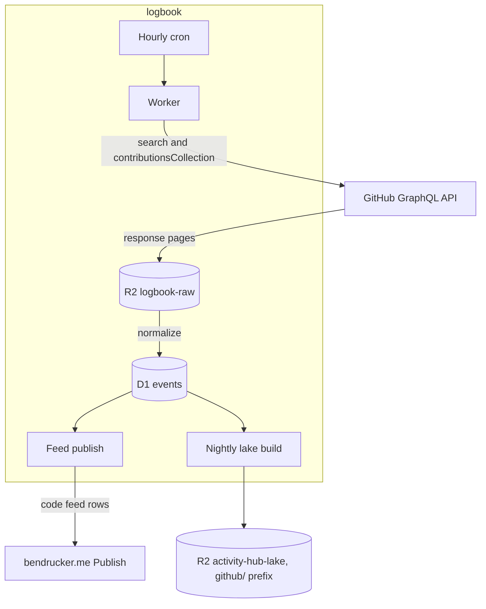

# Logbook

System of record for the personal data I pull from APIs on a schedule. A cron-driven Worker polls a source, archives every response page in R2, normalizes it into D1, and publishes one row per event to [bendrucker/bendrucker.me](https://github.com/bendrucker/bendrucker.me).

GitHub is the first source: pull requests, reviews, issues, and commit counts from GitHub's GraphQL API. Other simple polled APIs can join it later. Sources that deliver webhooks or files to decode belong in [Activity Hub](https://github.com/bendrucker/activity-hub) instead.

## Why

The website's own GitHub sync stores one aggregate row per repository per year. That shape cannot answer "this month", cannot count lifetime repositories without double counting one across years, and cannot produce a record like largest PR or most reviews in a week. Every new number on the homepage costs another aggregate table, a backfill script, and a cache validator. One row per event makes each of those a SQL query instead.

[Activity Hub](https://github.com/bendrucker/activity-hub) is the sibling project and the wrong home for a polled source. Its pipeline is built on one activity being one raw file: a webhook delivers a pointer, the original FIT or GPX becomes the immutable record in R2, and a container decodes it into Parquet. GitHub has no file per event, no webhook for repositories I contribute to but do not own, and nothing to decode. What carries over is the boundary layer rather than the pipeline: raw responses in R2 before anything normalizes them, Parquet into the same lake bucket, and the site's `Publish` entrypoint as the only write path.

## Architecture

One Worker, one D1 database, an hourly sync cron, a nightly lake cron, and R2 for both raw pages and lake output. No queues and no container.



The raw bucket is the system of record. Rebuilding the event tables after a schema change replays those pages and spends no GitHub requests, which matters when a full backfill is a few hundred search calls.

Lake tables land under a `github/` prefix in the `activity-hub-lake` bucket that Activity Hub already writes. Sharing one bucket is what lets a single DuckDB session join rides against pull requests by day, and it is the only real cross-project concern.

The site is a read-only consumer. The design routes writes to its D1 through the `Publish` entrypoint it exposes over a service binding, which validates every row on arrival and answers a bad shape with a `ValidationError`. The binding would carry no credential and tell the callee nothing about who called, leaving that method list as the whole security boundary. None of it exists yet: the service binding and the publish path land with the feed.

See [docs/design.md](docs/design.md) for the full design, the extraction budget, and the decisions still open.

## Data Model

One row per event, at the grain GitHub hands over without crawling each repository.

| Table           | Grain                                                                                                                                                 |
| --------------- | ----------------------------------------------------------------------------------------------------------------------------------------------------- |
| `pull_requests` | One PR I authored: repository, number, title, created at, merged at, closed at, state, additions, deletions, changed files, comment and review counts |
| `reviews`       | One review I gave: repository, PR number, state, submitted at, PR author                                                                              |
| `issues`        | One issue I opened: repository, number, title, created at, closed at, state, comment count                                                            |
| `commit_days`   | One day of commits for one repository: repository, day, commit count                                                                                  |
| `repositories`  | One repository the event tables join to: owner, name, description, url, stars, primary language, created at, fork, visibility                         |

A sync state table alongside these records the last window read per event type. Commits are daily counts because that is how `contributionsCollection` already exposes them. Per-commit history, comment bodies, and individual review comments stay out of the first version. Each one needs a walk of every PR in every repository, and per-PR counts give most of the analytics value at a hundredth of the requests.

## Sync

The hourly cron runs one `updated:>` search per event kind plus `contributionsCollection` for the current year. Each search window opens an hour behind that kind's watermark, since GitHub's search index lags writes and upserts keyed on node ID make the overlap free. Kinds run one after another so the first the rate budget refuses ends the invocation.

A watermark is an ISO instant meaning synced through. It advances only after every page is in R2 and every row is in D1, and only forward. A backfill of an old month cannot rewind a caught-up kind. A kind with no watermark is skipped: a backfill sets the first one.

Backfill runs from an admin route against the same code path, paged so no invocation runs past its subrequest budget:

```sh
curl -X POST -H "Authorization: Bearer $ADMIN_TOKEN" \
  "$WORKER/admin/backfill?kind=pr-authored&from=2012-12"
```

A call enqueues the kind's windows from `from` to the present in the `crawl_units` frontier and drains them until the rate budget stops it: months for the search kinds, years for `kind=contributions`. It answers with the windows it fetched, the count still `pending`, and any `irreducible` windows. A window already in the frontier keeps its status, so calling again with the same `from` carries on where the last call stopped without refetching what finished. A call the rate budget or a GitHub secondary limit stopped also answers with `resumeAt`, and `bun run backfill` sleeps until then and calls again. Backfill requests go out at least a second apart. The hourly cron drains whatever share its own work leaves, so a large backfill also finishes unattended across hours.

A window whose response says it dropped data is split into narrower windows and marked `split`. Contributions narrow down the calendar from a year to quarters, months, days, half days, and hours. A window still truncated at an hour, or a truncated search month, is marked `irreducible`. Its rows still land, since truncation drops whole items and leaves the returned ones intact.

### Rate Budget

GitHub's 5,000 GraphQL points an hour are shared with every other tool on the token, so Logbook spends within limits set as Worker vars:

| Var                   | Value | Limit                                                  |
| --------------------- | ----- | ------------------------------------------------------ |
| `RATE_FLOOR_SYNC`     | 1,000 | Remaining quota the hourly sync never spends below     |
| `RATE_FLOOR_BACKFILL` | 2,500 | Remaining quota a backfill never spends below          |
| `RATE_SHARE`          | 300   | Points Logbook spends per rate window, across all runs |
| `RATE_CAP_CRON`       | 40    | Points one cron invocation spends                      |
| `RATE_CAP_BACKFILL`   | 150   | Points one backfill call spends                        |

Each `sync_runs` row records the points it spent and the last `remaining` GitHub reported. The spend in the current rate window is the sum of `cost` over the runs started in it, so the ledger needs no table of its own. The budget checks every request before it goes out and refuses one that would cross a limit, which ends the invocation with the watermark where it was. A 403 or 429 naming a secondary limit ends it the same way.

Each contributions year is checked against the event tables for that year. A disagreement lands on the run as a note rather than an error, because a search gap and a private contribution the token cannot see look the same from here. The note carries `restrictedContributionsCount`, which counts the private ones. GitHub counts reviews once per pull request, including my own, so the note sets that figure against distinct pull requests: `reviews 75 (38 own) vs 37 PRs`. `GET /admin/sync` reports it alongside the watermarks, each kind's pending and irreducible frontier windows, the last ten failures, and the most recent lake build.

## Lake

A second cron rebuilds the lake nightly at 09:30 UTC, reading D1 and writing Snappy Parquet under `github/v1/` in `activity-hub-lake`. Every table encodes before any is written, so a table that fails leaves the bucket on the last complete build rather than mixing one rebuilt table with four stale ones. `lake_builds` records each build with its per-table row counts, or the reason it failed.

To rewrite the tables before the next nightly build, run the same build from an admin route:

```sh
curl -X POST -H "Authorization: Bearer $ADMIN_TOKEN" "$WORKER/admin/lake"
```

## Secrets

| Secret         | Location                              | Consumer                        |
| -------------- | ------------------------------------- | ------------------------------- |
| `GITHUB_TOKEN` | Worker secret (`wrangler secret put`) | Every GitHub GraphQL request    |
| `ADMIN_TOKEN`  | Worker secret (`wrangler secret put`) | Bearer auth on the admin routes |

The GitHub token is a classic personal access token with no scopes, so the hub sees and publishes public activity only. [docs/design.md](docs/design.md#visibility) records the decision.

`ADMIN_TOKEN` is optional. `/admin/sync`, `/admin/backfill`, and `/admin/lake` answer 404 while it is unset. A deployment that never sets one exposes no admin surface.

## Infrastructure

`wrangler.jsonc` owns the Worker, the `DB` D1 binding, the `RAW` and `LAKE` R2 bindings for `logbook-raw` and `activity-hub-lake`, both cron triggers, and public vars: `GITHUB_LOGIN` for whose history the hub reads and the [rate budget](#rate-budget). The service binding to the site joins them when publishing lands. The deploy job applies migrations on merge to `main` once `CLOUDFLARE_API_TOKEN` is set. Until then they apply by hand with `wrangler d1 migrations apply DB --remote`.

There is no Terraform here. Activity Hub needs it for a DNS record, a Workers route, and the Cloudflare Access applications in front of its admin routes. This hub is reached by cron and by a service binding. It has no hostname to manage. `/admin/sync` sits behind `ADMIN_TOKEN` alone, with no Access application in front of it.

## Development

```sh
bun install
cp .dev.vars.example .dev.vars
bun run dev
```

`wrangler dev` reads `GITHUB_TOKEN` and `ADMIN_TOKEN` from `.dev.vars`, which is gitignored. A run with both left empty serves `/healthz` and answers the admin routes 404.

| Command             | What it does                                   |
| ------------------- | ---------------------------------------------- |
| `bun run dev`       | Runs the Worker locally                        |
| `bun run test`      | Runs the test suite                            |
| `bun run typecheck` | Type checks without emitting                   |
| `bun run lint`      | Lints                                          |
| `bun run format`    | Formats                                        |
| `bun run types`     | Regenerates Worker types from `wrangler.jsonc` |
| `bun run backfill`  | Walks `POST /admin/backfill` to completion     |

## Status

Extraction, normalization, the sync loop, and the lake build are written. Nothing is deployed, no D1 migration has been applied to production, and bendrucker.me still runs its own GitHub sync. Publishing the feed comes next, and the open decisions in [docs/design.md](docs/design.md) come before it.
