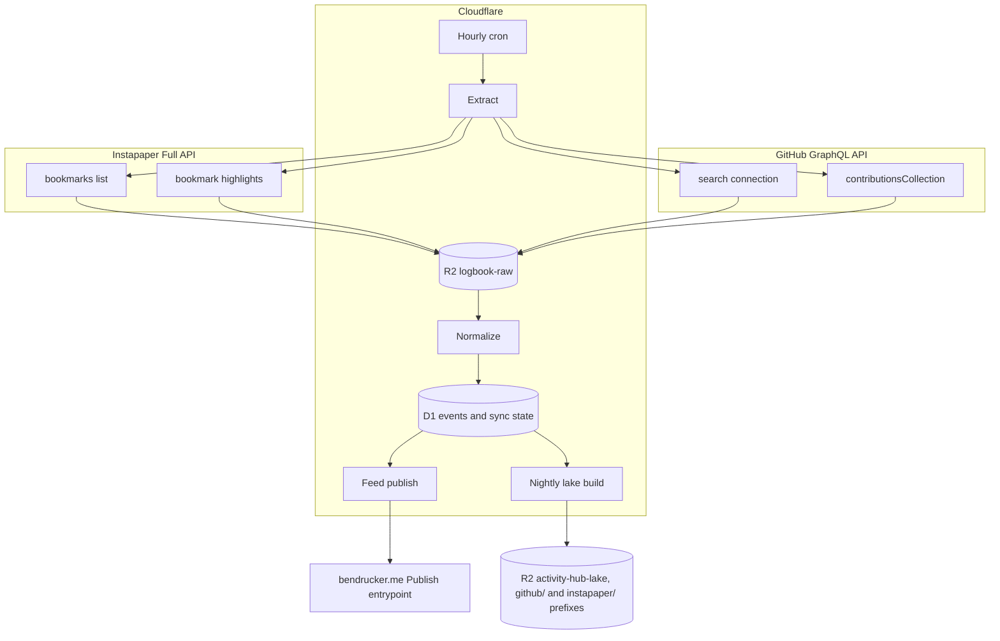

# Design

Logbook owns the personal data I pull from simple polled APIs. Webhooks and file decoding stay in [Activity Hub](https://github.com/bendrucker/activity-hub).

Two sources feed it. GitHub supplies pull requests, reviews, issues, and commit counts through its GraphQL API. [Instapaper](#instapaper) supplies bookmarks, highlights, and the notes on them through its Full API. Logbook archives every response page in R2, normalizes them into D1, publishes a GitHub feed to [bendrucker/bendrucker.me](https://github.com/bendrucker/bendrucker.me), and writes Parquet into the lake [Activity Hub](https://github.com/bendrucker/activity-hub) already maintains. This document records the architecture and the decisions behind it. Most of it describes GitHub, the first source. The [README](../README.md) is the short version.

## Goals

- Own the data. Every API response page lands in R2 before anything parses it. A schema change then replays history instead of re-querying the source.
- One row per event, so month, year, and lifetime totals are each a SQL query rather than another aggregate table with its own backfill.
- Separate contributions to other people's repositories from work on my own, because those are different claims about what I do.
- Publish a code feed to bendrucker.me on the same terms as the ride feed: the site validates on arrival, owns its schema, and reads only.
- Join code against rides in one DuckDB session by writing Parquet into the shared lake bucket.

## Non-Goals

- Comment bodies, individual review comments, and per-commit history. Each needs a walk of every pull request in every repository or a query per repository per branch.
- Real-time freshness. An hourly cron is enough for a homepage, and no faster cadence is reliable while GitHub's search index lags writes by an unspecified interval.
- Webhooks. GitHub delivers them for repositories I own, which is a fraction of the repositories a contribution feed cares about.
- Multi-user support. One account, single-tenant everywhere.
- Queues and containers. Nothing here needs decoding, and the incremental run is a handful of requests inside one Worker invocation.

## Architecture

One Worker, one D1 database, an hourly sync cron, a nightly lake cron, and R2 for both raw pages and lake output.



#### Worker

The cron runs extraction, normalization, and publishing in one invocation. There is no queue between the stages because the incremental run is a handful of requests: one windowed search per event type plus one `contributionsCollection` call for the current year, then one Instapaper listing per folder and the highlights of what changed. A backfill is larger and runs from an admin route or a script against the same code path, paged so no single invocation runs past its wall clock.

#### Raw Storage

Every response page is written to R2 before it is parsed, keyed by what produced it.

```text
raw/
  search/{kind}/{window}/{fetched_at}/{page}.json                               # kind is pr-authored, pr-reviewed, or issue
  search/{kind}/{window}/{fetched_at}/reviews/{pull request ID}/{page}.json     # review follow-up pages
  contributions/{window}/{fetched_at}.json                                      # 2015, 2015-Q3, 2015-07, 2015-07-14, 2015-07-14T00--2015-07-14T12, or 2015-07-14T00--2015-07-14T01
  contribution-events/{kind}/{window}/{fetched_at}/{page}.json                  # kind as in search, window as in contributions
  instapaper/{kind}/{window}/{fetched_at}/{page}.json                           # instapaper-bookmarks by listing or folders, instapaper-highlights by bookmark ID
```

An object is written once and never rewritten. Re-running a window writes new pages under a new fetch timestamp rather than replacing what a previous run saw. A normalization bug stays diagnosable against the bytes that caused it. The bucket is small: a search page of 100 nodes is tens of kilobytes and the whole history is a few hundred pages.

#### Normalization

Normalization reads the newest fetch under each window and writes D1. It never calls GitHub. That split is what makes a schema change cost nothing: bump the shape, re-run normalization over the archived pages, and the event tables rebuild from the responses already on disk.

Upserts are keyed on GitHub's node ID, so re-normalizing the same page changes no rows. An event that appears in two overlapping windows lands once.

#### Lake

A nightly build reads D1 and writes Snappy Parquet in the `activity-hub-lake` bucket, one file set per table, under a prefix per source: `github/v1/` and `instapaper/v1/`. The build is a full rebuild rather than an incremental merge, which is affordable because the corpus is tens of thousands of rows rather than millions of telemetry samples.

Sharing Activity Hub's bucket is deliberate. A query that asks which weeks had both high mileage and high review volume is one DuckDB session over two prefixes, and any other arrangement makes it a data transfer problem.

The build runs inside the Worker, which is what keeps containers a non-goal. `hyparquet-writer` encodes Parquet in pure JavaScript under workerd, and twenty thousand rows take tens of milliseconds.

Snappy rather than ZSTD because that writer ships no ZSTD compressor. Asking for ZSTD does not fail. It records the codec, stores the page uncompressed, and produces a file no reader accepts, so the codec is named at the call rather than left to a default. Activity Hub writes ZSTD from DuckDB in its container, and DuckDB reads either prefix without being told which.

Timestamps land as Parquet `TIMESTAMP_MILLIS` rather than the ISO strings D1 holds, since DuckDB then reads them as timestamps with no cast.

## Data Model

#### Identity

Every GitHub event's primary key is the GraphQL node ID GitHub returns, which is stable across renames of the repository and of the owner. `number` is stored beside it for readability, and `owner` and `name` come off the repository dimension each event joins to by `repository_id`.

#### Tables

| Table           | Columns                                                                                                                                               |
| --------------- | ----------------------------------------------------------------------------------------------------------------------------------------------------- |
| `pull_requests` | Node ID, repository, number, title, author, created at, merged at, closed at, state, additions, deletions, changed files, comment count, review count |
| `reviews`       | Node ID, repository, pull request number, state (approved, changes requested, commented), submitted at, pull request author                           |
| `issues`        | Node ID, repository, number, title, created at, closed at, state, comment count                                                                       |
| `commit_days`   | Repository, day, commit count                                                                                                                         |
| `repositories`  | Owner, name, description, url, stargazer count, primary language name and color, created at, fork, visibility                                         |

Additions, deletions, changed files, and the comment and review counts come off the pull request node's own fields. They cost nothing beyond the search page that already returned the node, and a record like largest PR falls out of them without opening a single diff.

`reviews` carries the pull request's author so reviews of my own work are separable from reviews I gave someone else. That distinction is the reason the table exists as its own grain rather than as a count on `pull_requests`.

Commits are per-repository daily counts because that is the finest grain `contributionsCollection` exposes without a query per repository per branch. `commitContributionsByRepository.contributions.nodes[]` carries a `commitCount` and an `occurredAt`, and one year of them is one request.

#### Operational Tables

`sync_state` is a key/value table. One key per event type holds the last window normalized successfully, and `updated_at` says when. The watermark advances only after the pages are in R2 and the rows are in D1. A failed run re-reads its window instead of skipping past it.

`sync_runs` holds one row per extraction attempt, written before the work starts so a run that dies mid-flight reads as one that never finished. It carries the kind, the window, page and row counts, whether the window truncated, an error, and a note the contributions cross-check writes when GitHub's yearly total disagrees with the event tables. `crawl_units` is the backfill frontier: one row per window with its parent and a status of `pending`, `done`, `split`, or `irreducible`. A unit is done only once its pages are in R2 and its rows are in D1. One the budget interrupts stays pending and restarts from its first page. `lake_builds` is that shape for the nightly build, carrying per-table row counts as JSON. `/admin/sync` reports the newest of each.

## Extraction

The search connection is the workhorse because it pages without bound when windowed by date. The `contributionsCollection` query supplies commits and the totals that cross-check everything else.

#### Search Windows

The `search` query returns [a maximum of 1,000 results](https://docs.github.com/en/graphql/reference/search#query-search) no matter how many matched. Its `issueCount` still reports the full match, so a window is truncated exactly when `issueCount` exceeds 1,000, and one matching exactly 1,000 is complete. Monthly windows keep every query well underneath it:

- `is:pr author:bendrucker created:2012-12-01..2012-12-31`
- `is:pr reviewed-by:bendrucker -author:bendrucker created:2012-12-01..2012-12-31`
- `is:issue author:bendrucker created:2012-12-01..2012-12-31`

The review search excludes my own pull requests. Replying to a review thread submits a `COMMENTED` review, so without the exclusion every reply on my own pull request counts as a review given. When the exclusion landed, 403 of 458 synced reviews for 2026 were those replies.

The upper bound is the month's real last day. A literal `-31` against a thirty-day month is a date GitHub's parser has to reinterpret, and these boundaries are what the whole cap mitigation rests on.

A month matching more than 1,000 splits in the backfill frontier. It halves into day ranges named for their ends, such as `2026-08-01--2026-08-15`, which halve again down to single days. A day splits into halves and a half into hours, named like the contributions windows (`2026-08-14T00--2026-08-14T12`) and queried on instants. An hour still past the cap is irreducible. Each window archives under its own key in `raw/search/{kind}/{window}/`.

The review search reads each pull request's reviews through a nested `reviews(author:, first: 100)` connection. A pull request whose nested page announces a successor gets a follow-up `node(id:)` query that pages the rest. Those pages archive beside the search page under `reviews/{pull request ID}/`, and replay merges them back in. A follow-up that fails still leaves its search page and the earlier follow-ups archived and normalized. The failed response lands as that pull request's next follow-up page rather than as a search page. A pull request whose `reviews.totalCount` still exceeds the nodes read flags its page as truncated, live and on replay. The search pager also stops with a `RepeatedCursorError` when a page announces a cursor it already sent, which would otherwise serve the same page until the page bound.

Walking those back to 2012 is 166 windows per event type for the whole history. The incremental run is the same code path with a different window: one `updated:{since}..{now}` query per type, where `since` sits an hour behind the watermark. The upper bound is what lets a range past 1,000 after an outage split: it halves at its midpoint, earliest half first, and the watermark climbs through each half as it lands. Backfill and incremental differ only in what dates go into the string.

#### Contributions Collection

`user.contributionsCollection(from, to)` takes at most a year per request. Its [`to` argument](https://docs.github.com/en/graphql/reference/users#object-user) defaults to the earlier of now and a year past `from`. The reference documents that default and says nothing about what a wider window does, so the client never sends one. A full history is one request per year. The backfill walks every calendar year from its first month, since a year with nothing in it costs a single request.

`commitContributionsByRepository` returns a plain list rather than a paginated connection, and its `maxRepositories` argument defaults to 25. Anything past the value it is given is dropped with no error and no cursor to follow. The query asks for 100. A window is truncated when it lists fewer repositories than `totalRepositoriesWithContributedCommits`, which the same response reports, so a window holding exactly 100 of 100 is complete.

Each repository's `contributions` list, one node per day with commits, is capped at 100 the same way. Its `totalCount` is the repository's commit total for the window, not its number of days, so a repository whose listed `commitCount` sums short of that total lost days. A final guard compares every listed commit against `totalCommitContributions`. A repository with commits on more than 100 days of a year loses the rest. A truncated window is fetched again as narrower windows down the calendar: a year to quarters, a quarter to months, a month to days, a day to halves, and a half to hours. An hour still truncated is irreducible. Each window is archived under its own key, and replay lists the year's prefix, takes the newest fetch of each window, and combines them. A window from a day up lists whole days, so any window naming a repository's day holds its count. A window narrower than a day counts part of each day, so its siblings add up. Replay takes the larger of a window's own count and its children's sum, which covers both. A live run fetching part of a day replays that day from the archive for the same reason.

The same query asks for the collection's own totals: `totalCommitContributions`, `totalPullRequestContributions`, `totalPullRequestReviewContributions`, `totalIssueContributions`, `totalRepositoriesWithContributedCommits`, and `restrictedContributionsCount`. Those are the cross-check. A year whose event table count disagrees with GitHub's own total means a search window truncated or a private contribution is being counted on one side and not the other.

`totalPullRequestReviewContributions` counts pull requests rather than reviews, and it includes reviews on my own pull requests, which the `reviews` table excludes. The cross-check therefore sets it against distinct pull requests by the year of their first review and reports the pair as `reviews 75 (38 own) vs 37 PRs`. The own count comes from the year's archived review connection pages, and is taken off GitHub's figure when those pages list as many pull requests as GitHub reports.

Issues and pull requests compare as sets when the year's archived connection pages list exactly as many events as GitHub's total. The note then names the node IDs on each side of a gap, `issues 186 vs 101 (missing I_a, I_b and 83 more)`, rather than a bare count. An archive of any other size is stale or partial, and the check falls back to the totals.

#### Contribution Connections

`contributionsCollection` also exposes cursor-paged `issueContributions`, `pullRequestContributions`, and `pullRequestReviewContributions`. They list exactly what GitHub counts, including issues search hides: an issue in a repository that later turned Issues off drops out of search while the collection still counts it. They run as three backfill kinds, `issue-contributions`, `pr-contributions`, and `review-contributions`, a second enumeration over the same event tables that upserts on node ID.

Each node carries its `Issue` or `PullRequest` with the fields the matching search selects, through a shared fragment, so normalization reuses the search row builders. A review node names one pull request, and the query reads that pull request's `reviews(author:, first: 100)`, so every review on it lands. Review nodes on my own pull requests are dropped, as the review search excludes them.

The windows are the contributions calendar windows, rooted at years. A unit reads at most ten pages of 100. One that exhausts its pages having read fewer nodes than the connection's `totalCount`, or stops at ten pages with a successor announced, is truncated and splits down the calendar like a commit window. The pager shares the search pager's cursor loop and its repeated-cursor guard.

Search stays. Connections enumerate by creation, so only an `updated:` search finds an old event whose state changed, and search also finds events GitHub declines to count as contributions. The union of both is the most complete set either source sees.

#### Rate Budget

The GraphQL API allows [5,000 points per hour](https://docs.github.com/en/graphql/overview/rate-limits-and-node-limits-for-the-graphql-api#primary-rate-limit) for a personal access token, and it scores a query on how many nodes it asks for. A search page of 100 nodes with no nested connection under it is one point. Nested connections multiply rather than add. A query that grows a sub-connection costs more than its node count reads on the surface. Every archived request so far has cost 1 point, including the reviewed-PR search with its nested `reviews(first: 100)`. The full backfill is a few hundred requests, which the share below spreads over a few rate windows. The incremental run is noise against it.

Each response carries `rateLimit.remaining`, `rateLimit.cost`, and `rateLimit.resetAt`. Only `rateLimit` reflects the point budget. The REST `GET /rate_limit` endpoint undercounts GraphQL spend.

The budget is shared with every other tool on the token, and those tools spent about 900 points in 18 minutes on one sampled hour. Logbook therefore spends within three limits, set as Worker vars:

- A floor on `remaining`: 1,000 for the hourly sync, which costs about 4 points and should still run on a busy hour, and 2,500 for a backfill, which yields half the budget to the other tools.
- A share of 300 points per rate window, whatever is left.
- A cap per invocation: 40 for the cron and 150 for a backfill call. The cap bounds wall clock and subrequests.

The ledger is derived. Each `sync_runs` row records the points it spent and the last `remaining` it saw, and the spend in the current window is the sum of `cost` over runs started since `resetAt` minus an hour. A request goes out when the last `remaining` minus its expected cost stays at or above the floor, the window's spend stays within the share, and the invocation's spend stays within the cap. The first request of an invocation is what learns the window, so it goes out on the cap alone. A refusal ends the invocation on a watermark it can resume from, and reports the reset to wait for.

GitHub also documents secondary limits: 100 concurrent requests and 2,000 points a minute for GraphQL. Logbook sends one request at a time. A backfill spaces requests at least two seconds apart, which keeps search within the 30 a minute GitHub documents for REST search in case GraphQL search shares it. A 403 or 429 carrying `retry-after` or a secondary-limit message stops the invocation the way a refusal does, and reports the wait.

#### Validation

Responses are validated with zod at the boundary, types are inferred from the schemas, and nothing is cast. Two patterns in the site's existing `packages/github/src/schema.ts` are worth carrying over whatever happens to that package:

- A `nodes()` helper collapsing a connection's nullable list of nullable entries into a plain list, since callers only ever iterate it.
- A `pageInfo` discriminated union pairing `hasNextPage: true` with a required `endCursor`. A page that announced a successor without the cursor to reach it would otherwise send the paginator back to the first page for as long as it kept going.

## Site Integration

#### Feed Contract

The hub publishes a `code_feed` the way Activity Hub publishes `activity_feed`: one row per event, storing what GitHub said and converting nothing. The site's `Publish` entrypoint gains a method, or a second entrypoint, that validates each row by name on arrival.

The service binding carries no credential and gives the callee no caller identity. The method list is the entire security boundary: one event per call, upsert and delete only, no bulk write and no read. A shape violation comes back as a `ValidationError`. Only an error's `name` and `message` cross the RPC boundary, which is why the hub branches on that name to park a row that will never be valid instead of retrying it.

Publishing is driven off D1 rather than off the extraction watermark. Each event row records when it was last published, and the cron sends whatever the normalizer touched more recently than that. An RPC failure that is not a `ValidationError` leaves the marker unmoved and the row goes again on the next run. A site outage costs a retry rather than a re-extraction.

The repository dimension publishes too. The site's `repos` table exists only to serve the code page. The hub owning it removes the last reason for the site to talk to GitHub at all.

#### Cache Validators

The site's activity pages and homepage key their ETags on `sync_state.version`, which `recordSync` bumps when a sync changed rows. Whatever the publish path writes has to bump that same version or those pages serve stale ETags against fresh data. `src/middleware.ts` and `src/middleware/cache.ts` read it.

#### Site Retirements

Once the hub publishes, running both syncs means two writers disagreeing about the same page. These go:

- `workers/github`, the hourly cron.
- `packages/github`, the client.
- `scripts/backfill-github-activity.ts` and `scripts/fetch-github-activity.ts`.
- The `repo_activity` schema, one aggregate row per repository per year.

`src/pages/activity/code.astro` and `src/activity/query.ts` move onto the feed.

Site migrations apply to production D1 only on push to `main`, and PR previews share the production database. A preview cannot read a table its own migration has not applied yet. The schema change lands and merges before the code that reads it.

#### Homepage Needs

The feed exists to answer these without a bespoke table per question:

- Totals by month, by year, and all time, for pull requests, reviews, and a third figure that sums cleanly across periods. Commits work. Repositories do not, because a repository touched in two years is one repository and two rows.
- Lifetime records for a ticker: first repository year, most-starred repositories contributed to, largest pull request by changed lines.
- The recent-repositories list the code rail already shows.

## Backfill

Backfill and incremental sync are the same code with different windows, so there is no second implementation to keep correct.

- Walk monthly search windows back to 2012 for each event type. I created my first repository on 2012-12-27, and nothing earlier will match.
- Walk `contributionsCollection` per calendar year from the backfill's first month.
- Page the three contribution connections per year, which recovers events the search index hides.
- Write every page to R2, then normalize.

It runs from an admin route or a local script. A call enqueues root windows in `crawl_units` and drains the frontier until the rate budget's cap, so a single invocation stays inside its wall clock and the next call resumes from the frontier. The hourly cron drains what share its own work leaves, so a large backfill finishes unattended.

Re-normalizing costs no GitHub requests, which is the point of writing raw pages first. The event tables can be rebuilt as many times as the schema changes.

For sizing: the site's current tables report 62 repositories touched in 2026, with 852 pull requests, 28 reviews, and 321 issues for that year. Extrapolating over a decade puts the event tables in the low tens of thousands of rows, which is small for D1 and smaller for Parquet.

## Operations

- The hourly cron runs one `updated:{since}..{now}` search per event type plus one `contributionsCollection` call for the current year, then an [Instapaper](#instapaper) pass.
- A second cron rebuilds the lake at 09:30 UTC. It sits off the hour so it never shares an instant with a sync invocation, and `scheduled` tells the two apart by the cron expression.
- `GITHUB_TOKEN`, `ADMIN_TOKEN`, and the four `INSTAPAPER_*` credentials are Worker secrets, set with `wrangler secret put`.
- The deploy job applies migrations on merge to `main` once `CLOUDFLARE_API_TOKEN` is set, which matches how the site and Activity Hub both work. Until then they apply by hand with `wrangler d1 migrations apply DB --remote`.
- An admin route reports the last successful sync per event type, the lag on the oldest window still unread, recent failures, and the last lake build, in the shape of Activity Hub's `/admin/pipeline`.
- The `contributionsCollection` totals are checked against event table counts per year. Drift is the signal that search missed something, such as an issue in a repository that later turned Issues off. Search hides it, and the totals still count it. A backfill of the contribution connections fills it, and the note names the node IDs still behind a gap.
- The backfill is roughly 500 search requests plus one per year, well inside the 10,000 subrequests a paid Workers invocation gets. Paging it across invocations answers the wall clock rather than a platform ceiling. The free tier's 50 subrequests would bind first.
- The [rate budget](#rate-budget) reads `rateLimit` off each response and refuses a request before it crosses a limit, rather than waiting for a 403.

## Risks

- The search cap drops results without an error. `issueCount` past 1,000 is the only signal. Monthly windows keep the real counts far below it, and a window past it splits down to hours.
- GitHub's search index lags writes by an unspecified interval, so an `updated:` window anchored exactly at the last sync can miss an event indexed late. The window overlaps the previous one, and upserts keyed on node ID make the overlap free.
- `commitContributionsByRepository` returns a fixed-length list and reports no truncation beyond the totals beside it. Calendar splitting recovers both overflowing days and repositories past the 100 cap, down to an hour. An hour that touched more than 100 repositories stays irreducible and flagged.
- `restrictedContributionsCount` counts contributions hidden from the viewer. With a token that sees no private repository, that is every private contribution, so the cross-check reports it beside the gaps instead of subtracting it.
- Search discovers only what exists. A pull request or repository deleted on GitHub stops matching every window and its rows go stale in place. Nothing here reconciles that, and a periodic re-walk of past windows is the only cheap detector.
- A public repository that goes private drops out of every later search, and the raw bucket becomes the only copy of its events.
- The cutover has two writers on the site's code page. Retiring the site's sync belongs in the same change that turns on publishing.
- Instapaper's listing reaches only the newest 500 bookmarks of each folder. [Gaps](#gaps) lists what that and the other Instapaper limits leave out.

## Instapaper

Instapaper is the second source: every bookmark across Unread, Archive, Starred, and my own folders, with its highlights and the note on each. The tables are shaped so a later feed can select starred bookmarks with their notes in one join.

| Table                   | Columns                                                                                                                                                   |
| ----------------------- | --------------------------------------------------------------------------------------------------------------------------------------------------------- |
| `instapaper_bookmarks`  | Bookmark ID, url, title, description, saved at, starred, folder and folder ID, progress, progress at, private source, tags, hash, unlisted at, deleted at |
| `instapaper_highlights` | Highlight ID, bookmark ID, text, note, position, created at                                                                                               |
| `instapaper_folders`    | Folder ID, title, slug, position, public                                                                                                                  |

#### Access

The Full API signs every request with OAuth 1.0a over HMAC-SHA1, computed with Web Crypto. xAuth trades a username and password for an access token once. `bun run instapaper:login` reads the consumer key and secret from `.dev.vars`, prompts for the password without echo, and prints the token and secret to store. Instapaper's terms forbid keeping the password, and the script never writes it. The token lasts until the password changes or access is revoked. The Worker holds `INSTAPAPER_CONSUMER_KEY`, `INSTAPAPER_CONSUMER_SECRET`, `INSTAPAPER_ACCESS_TOKEN`, and `INSTAPAPER_ACCESS_SECRET`. The cron skips Instapaper while any of them is unset.

#### Listing

`bookmarks/list` has no cursor. It answers the newest bookmarks of one folder, at most 500. `have` takes `id:hash` pairs for bookmarks the client already holds, and those whose hash still matches drop out of the answer. `delete_ids` names the `have` bookmarks outside the folder's window. The hash covers url, title, description, and reading progress. `have` also accepts progress, and Instapaper writes a newer one back to the account, so the sync sends hashes alone and never alters the account.

#### Hourly Pass

The pass reads `folders/list`, then one delta per listing: Unread, Archive, each of my folders, and Starred. Each sends as `have` every bookmark D1 places in that listing. A returned bookmark upserts. A folder listing places it there and clears `unlisted_at`. The starred listing sets `starred` and leaves the folder alone. `delete_ids` from a folder listing set `unlisted_at` on the bookmarks D1 still places in that folder, so a bookmark another listing already moved keeps its new place. From the starred listing they unstar, but only while `have` plus the returned bookmarks fit in 500.

Every bookmark the pass returned has its highlights unit put back to pending. What the cap leaves drains the bookmarks frontier, then the highlights frontier. The `instapaper-bookmarks` watermark takes the pass's start once every listing lands. Until a backfill sets it, the pass is skipped.

#### Highlights

`POST /api/1.1/bookmarks/{id}/highlights` returns a bookmark's complete highlight list, so a highlight D1 holds that the list omits was deleted. Error 1241 on that read means the bookmark itself is gone, and it sets `deleted_at`. `instapaper-highlights` runs only as frontier units and has no watermark. The listing's own `highlights` array lands too, but the documentation does not say which highlights it carries. A read that fails without a limit behind it settles its unit `irreducible`, so one bookmark cannot hold the frontier. The unit goes back to pending when the bookmark next comes back changed.

#### Backfill

```sh
curl -X POST -H "Authorization: Bearer $ADMIN_TOKEN" "$WORKER/admin/backfill?kind=instapaper-bookmarks"
curl -X POST -H "Authorization: Bearer $ADMIN_TOKEN" "$WORKER/admin/backfill?kind=instapaper-highlights"
```

A bookmarks backfill reads `folders/list` and enqueues one unit per listing. A unit reads its folder whole. A full page leads to another that sends every bookmark read so far as `have`, which pages past the first 500 only if `have` works as a cursor. Documented behavior says it filters instead, so the second page comes back empty and the unit settles `irreducible`. Twenty pages bound a read if it does page. Once no unit is pending, the watermark takes the earliest unit's fetch time and the hourly pass takes over. A highlights backfill enqueues every bookmark not known to be deleted, one request each. Instapaper lists by folder rather than date, so `from` is ignored.

#### Rate Limit

The documentation names error 1040 for a rate limit and gives no number. `RATE_CAP_INSTAPAPER` caps one invocation at 50 requests, cron or backfill. A 1040 stops the run with `resumeAt` from `Retry-After`, or an hour when there is none. Instapaper runs record `cost` 0, so the spend ledger stays GitHub's. A highlights backfill of 5,000 bookmarks is 100 calls.

#### Replay

`replayInstapaper` rebuilds the three tables from `raw/instapaper/`. A delta page's `delete_ids` mean what they meant against the tables when it was fetched, so pages apply in fetch order, and each run stamps its own time to keep that order. R2 custom metadata on each listing page records the mode and the size of `have`. A page archived as the failure that stopped its run never reached D1, and the replay skips it.

#### Gaps

- A folder past 500 bookmarks shows its newest 500. Older archived bookmarks are out of reach unless `have` pages, and the backfill marks such a folder `irreducible` so the gap shows in `/admin/sync`. A folder of exactly 500 reads the same way, since its second page comes back just as empty.
- No endpoint lists deletions. A deleted bookmark drops into `delete_ids` and reads as `unlisted_at`, the same as one moved to a folder the pass hasn't reached or one that aged out of the 500. `deleted_at` is set only when a highlights read answers 1241.
- A highlight added, or a note edited, on a bookmark whose hash is unchanged waits for the next highlights read of that bookmark, unless the listing's `highlights` array carries it.
- With more than 500 starred bookmarks, an unstar goes undetected.
- The free tier limits highlight creation to five a month. The documentation does not limit reading the archive or the API on the free tier. A Premium-only answer would arrive as error 1041. It fails a listing run and settles each highlights unit it answers `irreducible`.
- Each hourly pass archives a page per listing, about 40,000 small objects a year with a few folders. The bucket stays small in bytes.

These wait on a live check with the real token: whether `have` pages, what the listing's `highlights` array covers, how 1040 arrives, and whether the free tier answers 1041 anywhere the sync reads.

## Visibility

The hub reads public activity only. `GITHUB_TOKEN` is a classic personal access token with no scopes, so GitHub filters private repositories out before any response reaches the hub. Nothing private is stored, archived, or published, and no layer downstream has a redaction path to get wrong.

Totals understate real activity by `restrictedContributionsCount`. Reversing the choice means a token with `repo` scope, a full backfill, and a filter at publish.

## Open Decisions

These are still open.

#### Involvement Queries

`author:` alone undercounts reviews and co-authored work. `involves:` overcounts drive-by mentions. The site's current sync splits the difference, using `involves:` for issues and `is:pr is:merged user:bendrucker -author:bendrucker` for merged pull requests into my own repositories, which counts work other people did that I merged. The set to pick from:

- `author:` and `reviewed-by:` only. Every row is work I did, and the numbers are defensible without a footnote.
- Add `involves:` for issues, which catches issues I participated in but did not open, along with every thread that mentioned me.
- Keep merged-into-my-repositories as its own event type rather than folding it into pull request counts, since it measures maintenance rather than authorship.

Whichever set wins gets documented here, because a homepage number is uninterpretable without knowing which query produced it. A public-only token keeps a wider set from pulling in private repositories.

#### Reusing `packages/github`

- Lift it. The zod schemas, the `nodes()` helper, and the paginated search wrapper exist and are tested, and the `contributionsCollection` query is already written.
- Write a new client. The package is shaped around per-repository aggregation, which is exactly what this project replaces, and every one of its search queries pulls the full repository fragment onto each node.

The zod discipline carries either way: validate at the boundary, infer the type from the schema, never cast.

## Future Work

Out of scope until the feed is live:

- Publishing the lake tables to R2 Data Catalog as Iceberg, following whatever Activity Hub settles on.
- A precomputed stats object regenerated by the nightly build, which would serve most homepage numbers at zero query cost.
- Comment and review-comment bodies, once there is a question that needs the text rather than the count.
- Per-commit history for my own repositories, where the request cost is bounded by repositories I own rather than by every repository I have touched.
